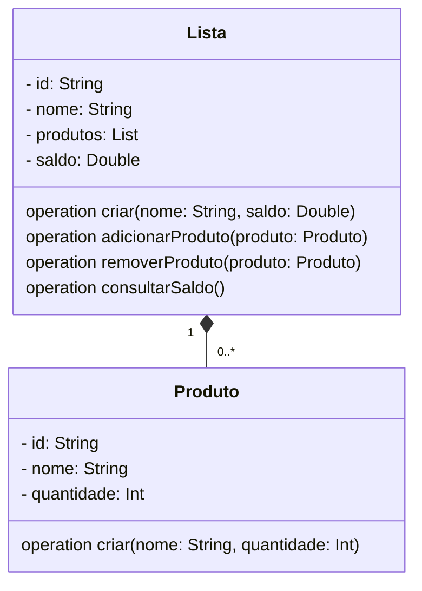

# Desafio BOOTCAMP SANTANDER 2023 - FULLSTACK JAVA+ANGULAR

### Publicando Sua API REST na Nuvem Usando Spring Boot 3, Java 17 e Railway

#### Diagrama de Classes da nossa lista de compras:

```mermaid
classDiagram
  class Lista {
    - id: String
    - nome: String
    - produtos: List<Produto>
    - saldo: Double

    operation criar(nome: String, saldo: Double)
    operation adicionarProduto(produto: Produto)
    operation removerProduto(produto: Produto)
    operation consultarSaldo()
  }
  class Produto {
    - id: String
    - nome: String
    - quantidade: Int

    operation criar(nome: String, quantidade: Int)
  }
  Lista "1" *-- "0..*" Produto
```
